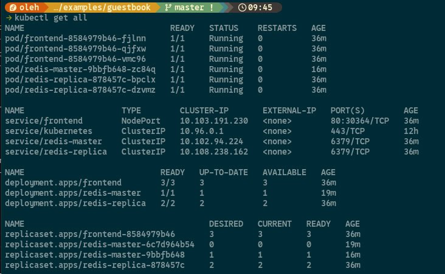
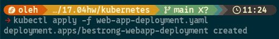

## Assignment

> "BeStrong" architecture team has made a decision to go with microservice architecture and start using Kubernetes.  
> You will need to make a PoC of Kubernetes-based microservice architecture for "BeStrong" application.  
> You as DevOps Engineer, need to install Minikube (or any other local K8s distribution) on your machine, and:
>
> 1. Deploy and test a sample app: https://github.com/kubernetes/examples/tree/master/guestbook/all-in-one
> 2. Deploy "BeStrong" API to local K8s and expose it, so you can access it from browser on local machine.
> 3. Prepare a report for your client with explaining your choice, as well as with architecture diagram for future Azure cloud deployment of your microservice architecture (you can use Draw.io/Lucidchart/Mermaid.js / other diagrams software) for the https://github.com/FabianGosebrink/ASPNETCore-WebAPI-Sample

## TASK 1

After the instalation of Minikube and kubeclt I cloned the sample repository

and ran

```bash
kubectl apply -f guestbook-all-in-one.yaml
```

As a result, containers have benn started running



After that:

```bash
minikube service frontend
```

And loaded page in browser

## TASK 2

I created kuberenetes manifests to deploy bestrong web-app. I heve applied deployment and service:



In web-app-deployment.yaml described that container needs to be pulled from local registry. After deploying a container It's api accessible in browser:


### TASK 3

#### We deployed our web-aplication using minikube. It helps us to run local kubernetes cluster. Using kubernetes have such benefits:

- ###### Fast deployment of our aplication
- ###### Easy scalability through replicas
- ###### Ability to add new microservices and test them immidiately
- ###### We can switch to Azure Kubernetes Service and continue our development there

#### In future we can deploy our application on ACR. Below is a is a diagram showing what our deployment flow will look like:


_When a developer pushes code, it triggers an automated workflow that builds a new container image, uploads it to ACR, and updates the running application in AKS — all with low downtime._

#### This feature can make our development process faster, more efficient and easier to manage
