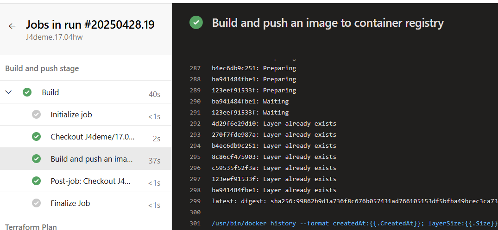
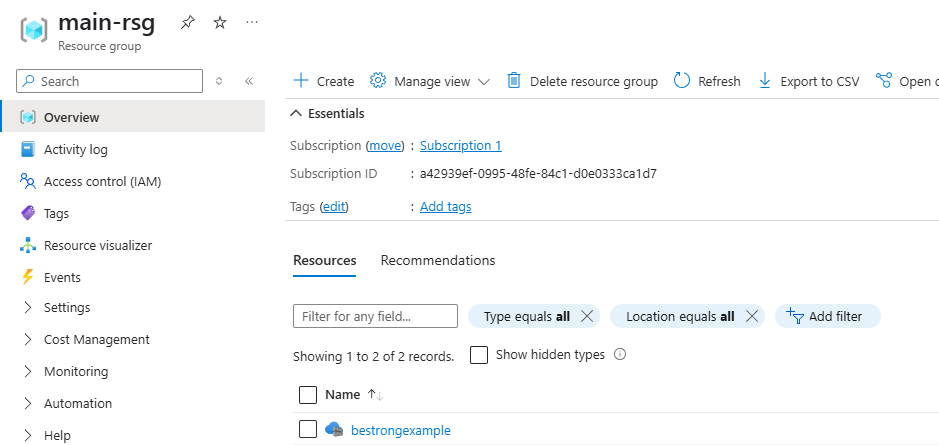
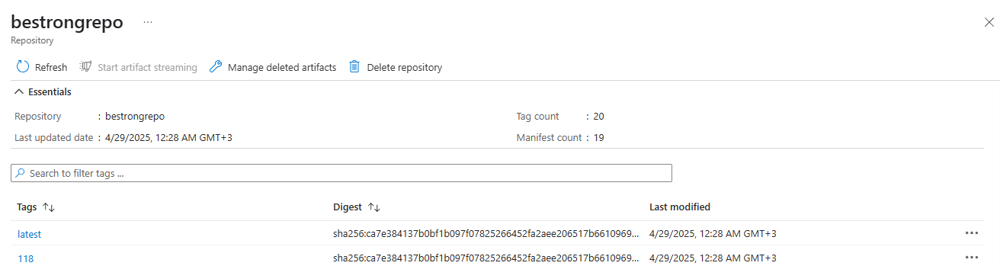

1. You need to create your own repo in Github and clone https://github.com/FabianGosebrink/ASPNETCore-WebAPI-Sample
2. Create one Dockerfile that will build application and run it.
3. Create dockercompose file that will inlude build (use local build context) and run stages, for local testing purposes, commit this file to repo.
4. Write your own Azure DevOps build flow using yaml syntax and commit it into your GitHub repo. Build and deploy from the main branch. Build PR (Pull Request).
5. Although you have multiple options to deploy the dockerized application, your manager heard about Azure App Service and knows that you have Terraform code for that. You should determine whether it's necessary to use the old Terraform code, Terraform code with modified configuration, or choose another platform and write Terraform code for it. Although you should write Terraform configuration, there's no requirement to implement CI/CD for it (but you can use your previous pipelines to address this and bring additional value).

### Creation of a Dockerfile:

```dockerfile

FROM mcr.microsoft.com/dotnet/sdk:7.0 AS build
WORKDIR /src

COPY . .

WORKDIR /src/SampleWebApiAspNetCore

RUN dotnet restore

RUN dotnet publish -c Release -o /app/publish

FROM mcr.microsoft.com/dotnet/aspnet:7.0
WORKDIR /app

COPY --from=build /app/publish .

ENTRYPOINT ["dotnet", "SampleWebApiAspNetCore.dll"]

```

### Creation of docker-compose:

```yml
version: "3.8"

services:
  webapi:
    build:
      context: .
      dockerfile: Dockerfile
    ports:
      - "8080:80"
    environment:
      - ASPNETCORE_ENVIRONMENT=Development
```

### Result of Build pipeline:







### Result of creating an infrustructure in Azure using terraform


### Testing with Postman

 
